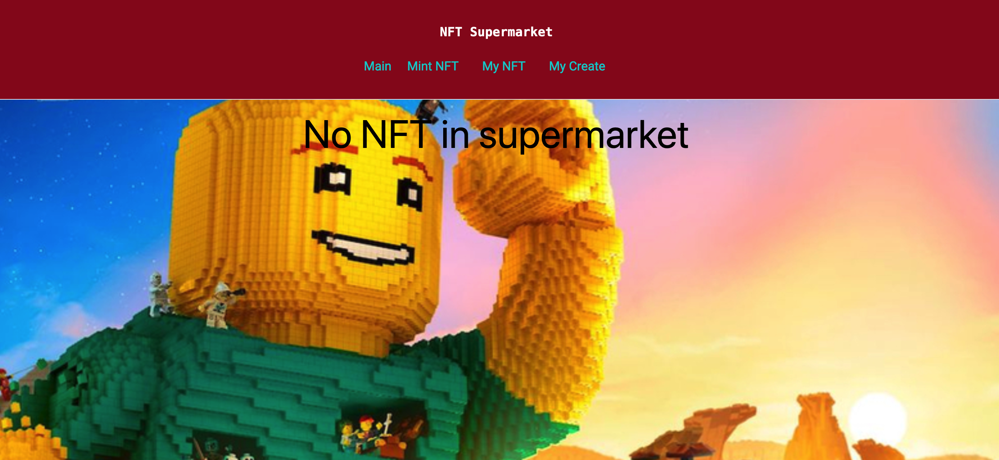
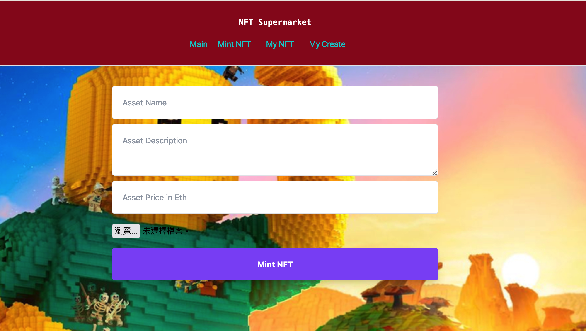
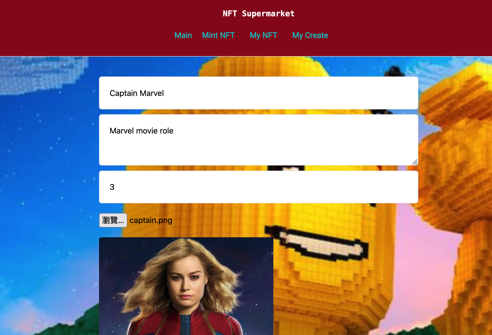
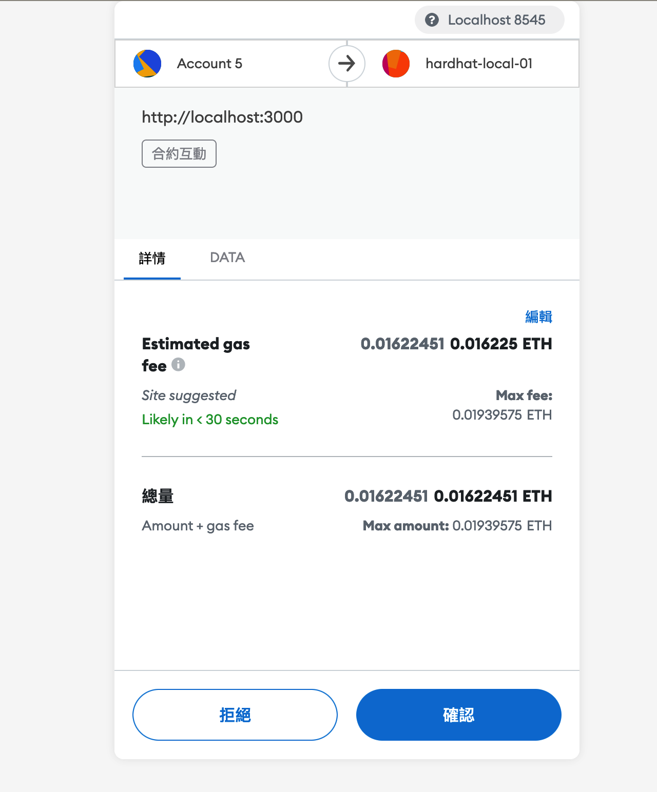
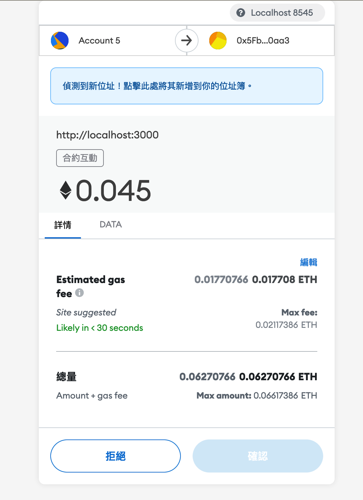
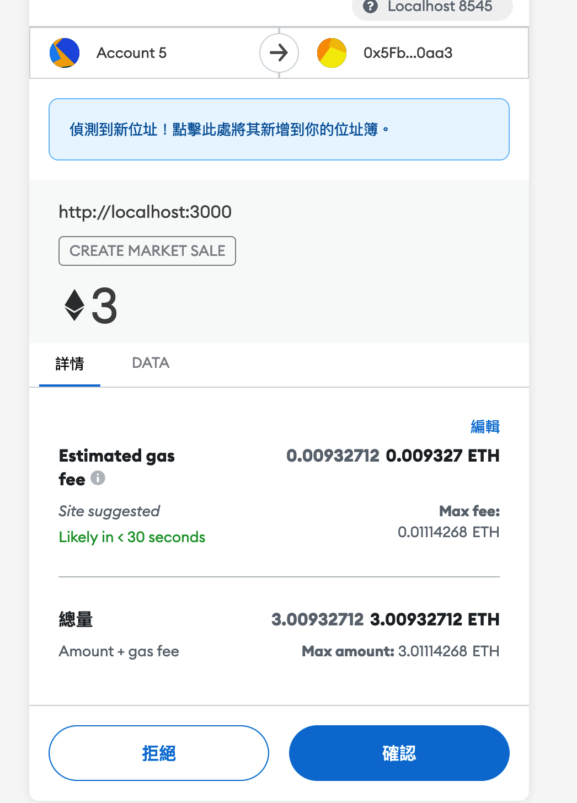
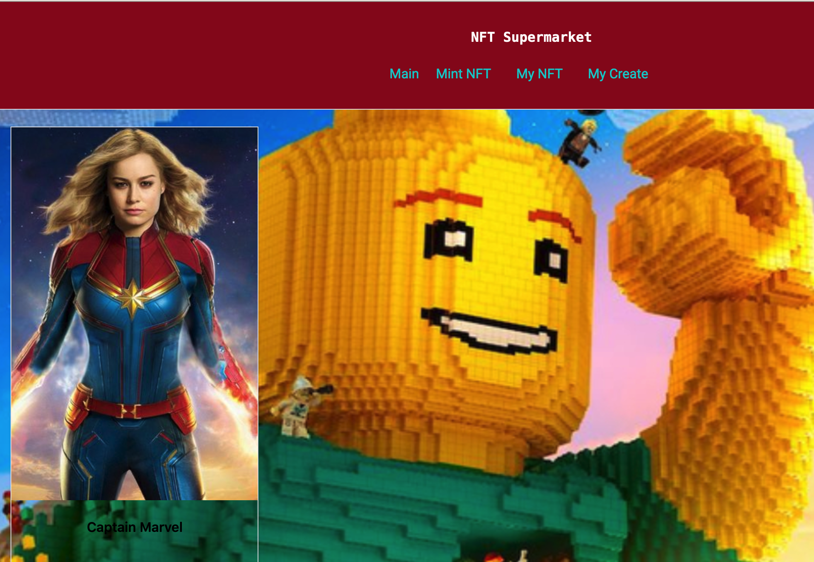
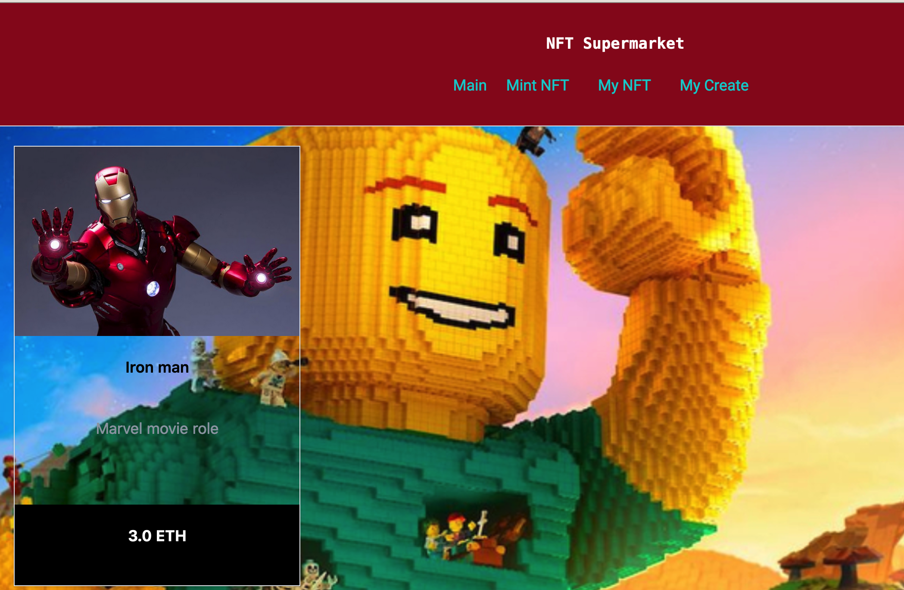

# NFT Supermarket simple demo

Build with Hardhat, Solidity, ether.js, IPFS, React

## Goal

User can mint, sell and buy NFT on web.

## Run

- install packages in need.
- 'npx hardhat node'
- 'npx hardhat run scripts/deploy.js --network localhost'
- 'npm run dev'

## Tools

- smart contract - Solidity
- dev & test framework - hardhat and Chai
- Web - React, Next and ether.js

- ethereum node API service - Infura [doc](https://infura.io/docs/ethereum)
- metamask

### main package used

- IPFS-http-client [JS](https://github.com/ipfs/js-ipfs/tree/master/packages/ipfs-http-client)
- ether.js [doc](https://docs.ethers.io/v5/single-page/#/v5/getting-started/)

## Demo result

No NFT in main page in the beginning  
   

Mint file to NFT token  
   

upload file and connect to metamask to check to mint  
   
   

pay the listing fee  
   
see the NFT on main page and my create  
   
   

buy NFT  
   
in main page  
   
in My NFT page  
   
